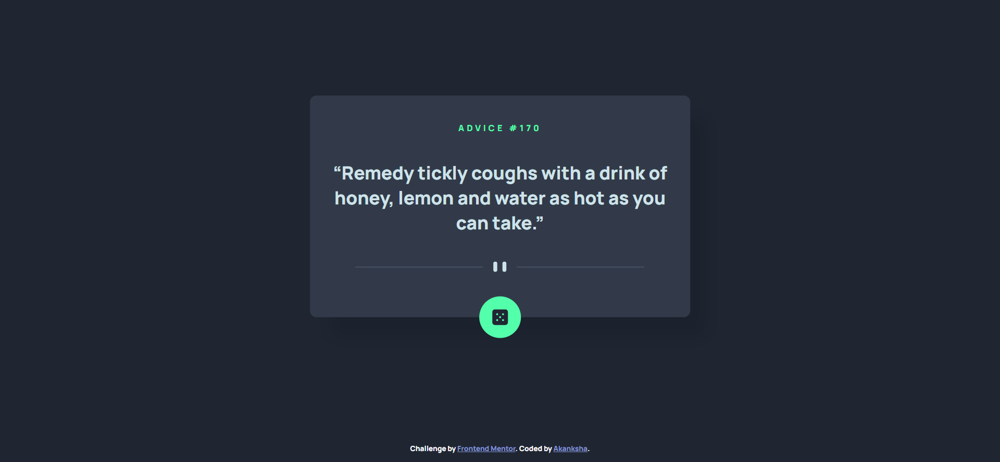

# Frontend Mentor - Advice generator app solution

This is a solution to the [Advice generator app challenge on Frontend Mentor](https://www.frontendmentor.io/challenges/advice-generator-app-QdUG-13db). Frontend Mentor challenges help you improve your coding skills by building realistic projects.

## Table of contents

- [Overview](#overview)
  - [The challenge](#the-challenge)
  - [Screenshot](#screenshot)
  - [Links](#links)
- [My process](#my-process)
  - [Built with](#built-with)
  - [What I learned](#what-i-learned)
  - [Continued development](#Continued-development)
- [Author](#author)
- [Acknowledgments](#acknowledgments)

## Overview

### The challenge

Users should be able to:

- View the optimal layout for the app depending on their device's screen size
- See hover states for all interactive elements on the page
- Generate a new piece of advice by clicking the dice icon

### Screenshot

#### Screenshot - PC



#### Screenshot - Mobile


### Links

- Solution URL: [solution URL](https://github.com/akankshav108/advice-generator-app)
- Live Site URL: [live site URL](https://akankshav108.github.io/advice-generator-app/)

## My process

### Built with

- Semantic HTML5 markup
- CSS custom properties
- Flexbox
- JavaScript
- Async/Await

### What I learned

I learned how to make and api call using fetch() function and async/await.
Also learned little bit of animation using ketframes in css.

```css
@keyframes shake {
  0% {
    transform: rotate(15deg);
  }

  50% {
    transform: rotate(-15deg);
  }
  100% {
    transform: rotate(15deg);
  }
}
```

```js
async function getData() {
  await fetch("https://api.adviceslip.com/advice", {
    method: "get",
    chache: "default",
  })
    .then((res) => res.json())
    .then((data) => {
      document.getElementById("id").innerHTML = data.slip.id;
      document.getElementById("advice-text").innerHTML = data.slip.advice;
    })
    .catch((err) => console.log("error : " + err));
}
```

### Continued development

I want to learn more about different ways of fetching apis and also REST APIs.

## Author

- Website - Coming soon
- Frontend Mentor - [@yourusername](https://www.frontendmentor.io/profile/akankshav108)

## Acknowledgments

I would like to acknowledge frontend mentor for providing this idea and various online platforms like stackoverflow for making my learing process easier.
